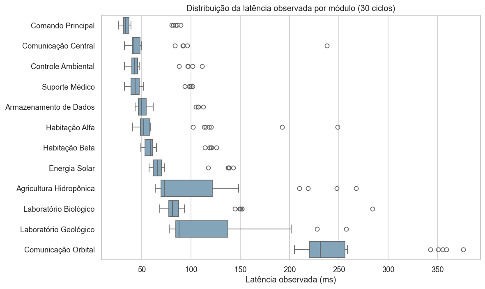
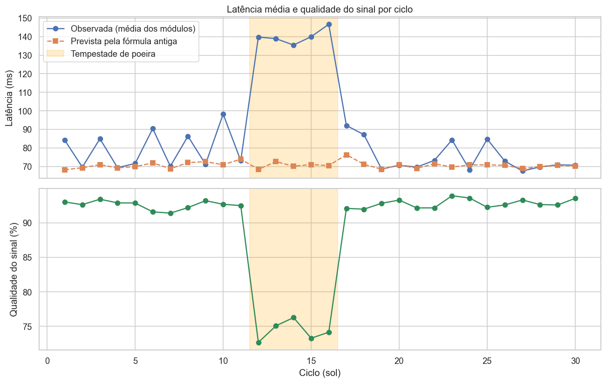
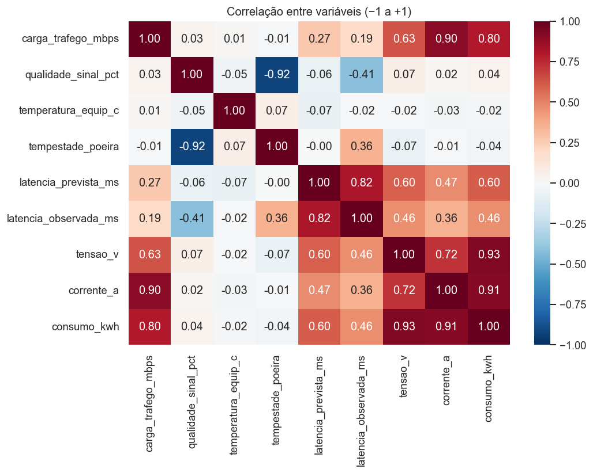
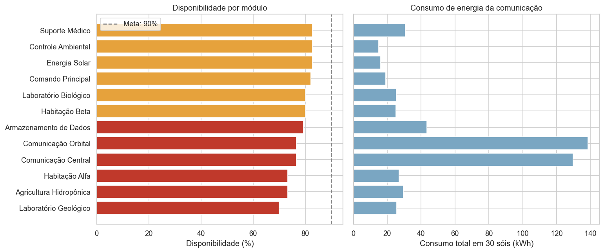
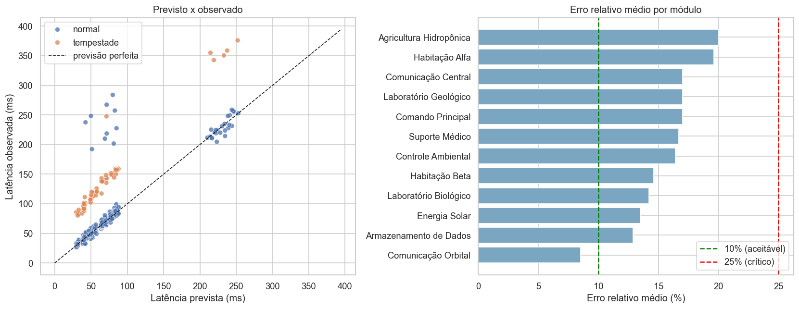
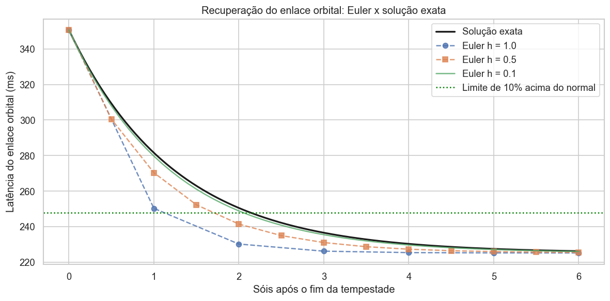
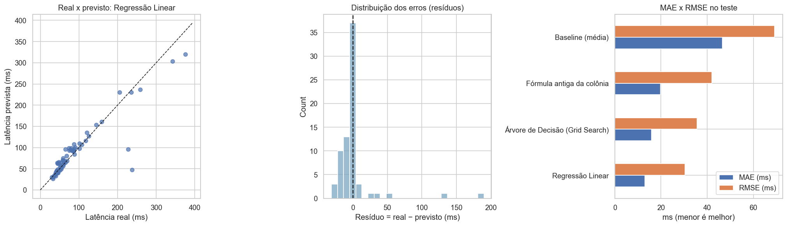

# Relatório Técnico: SCIC (Sistema de Comunicação Interplanetária da Colônia)

**Atividade Integradora · Fase 6 · Colônia Aurora Siger**

**Arquivo principal:** `notebook_projeto.ipynb`

**Equipe:** AI Team

| Integrante | RM |
|---|---|
| Antuny Marques de Menezes | 572105 |
| Éric Yuiti Nissi | 573495 |
| Vinícius Pelogia do Nascimento | 572675 |

---

## Sumário

1. Contexto da solução
2. Descrição dos dados
3. Indicadores operacionais e de comunicação
4. Análise numérica: erro absoluto, erro relativo e ponto flutuante
5. Simulação numérica com o método de Euler
6. Modelo simples de previsão e métricas de performance
7. Priorização de alertas com heap
8. Busca por prefixo com trie
9. Dispositivos, bases numéricas e eletricidade aplicada à comunicação
10. Gerenciamento inteligente da comunicação
11. Reflexão social, cultural e sustentável
12. Limitações e possíveis melhorias
13. Conclusão

---

## 1. Contexto da solução

A **Aurora Siger** é uma colônia em Marte com **12 módulos**: Habitação Alfa e Beta, Agricultura Hidropônica, Comunicação Central, Comunicação Orbital, Laboratório Geológico e Biológico, Suporte Médico, Armazenamento de Dados, Energia Solar, Comando Principal e Controle Ambiental. Os módulos trocam dados com a **Comunicação Central**. A colônia se comunica com a Terra pela **Comunicação Orbital**, que usa um satélite retransmissor.

A comunicação interplanetária tem dois componentes de atraso:

- **Atraso da luz entre Marte e a Terra (3 a 22 minutos):** é físico e inevitável. Por causa dele, a colônia precisa **decidir com autonomia**, sem esperar instruções da Terra.
- **Latência da rede local (milissegundos):** depende do tráfego, da qualidade do sinal, da temperatura dos equipamentos e de eventos como **tempestades de poeira**. **Ela pode ser monitorada e gerenciada, e é o foco do SCIC.**

A colônia usava uma **fórmula simples** para prever a latência de cada módulo. Essa fórmula considera a latência base e a carga de tráfego, mas **ignora tempestades e falhas momentâneas**. O SCIC foi criado para:

1. organizar os dados operacionais e de comunicação;
2. medir **quanto e quando** a previsão antiga falha;
3. propor um **modelo de previsão melhor** e avaliá-lo com métricas adequadas;
4. **priorizar os alertas** para a equipe humana agir primeiro no mais urgente;
5. permitir **consultas rápidas por prefixo**;
6. produzir uma **análise de apoio à decisão**.

O fluxo seguiu as seis etapas sugeridas no enunciado (Figura 1): **coletar dados simulados → organizar arquivos → calcular indicadores → avaliar modelo → priorizar e consultar → gerar relatório**.

---

## 2. Descrição dos dados

### 2.1 Origem e estrutura

A base `dados_aurora_siger.csv` foi **simulada pela equipe** com o script `gerar_dados_aurora_siger.py`, que usa semente aleatória fixa (42) e, portanto, é reprodutível. São **12 módulos × 30 ciclos**, em que 1 ciclo equivale a 1 sol (cerca de 24h39min). Uma **tempestade de poeira** acontece entre os **ciclos 12 e 16**.

| Coluna | Descrição |
|---|---|
| `ciclo`, `data_registro` | Ciclo da missão e data terrestre de referência |
| `modulo`, `tipo_modulo` | Nome e tipo (habitação, agricultura, comunicação, laboratório, suporte médico, armazenamento de dados, energia, comando, controle) |
| `codigo_sensor` | Código hexadecimal de 16 bits do sensor (`0xTMSS`) |
| `nivel_prioridade` | Essencialidade do módulo (1 a 5) |
| `carga_trafego_mbps` | Tráfego de dados do enlace |
| `qualidade_sinal_pct` | Qualidade do sinal (%) |
| `temperatura_equip_c` | Temperatura do equipamento (°C) |
| `tempestade_poeira` | 1 = ciclo com tempestade |
| `latencia_prevista_ms` | Previsão da fórmula antiga |
| `latencia_observada_ms` | Latência medida (valor real) |
| `tensao_v`, `corrente_a`, `consumo_kwh` | Alimentação elétrica e consumo |
| `status_operacional` | ativo, manutenção ou alerta |
| `mensagem_alerta` | Resumo do alerta |

As regras usadas na simulação refletem relações físicas plausíveis: a latência cresce com a carga, com a perda de qualidade do sinal, com o superaquecimento (acima de 30 °C) e com a tempestade. Durante a tempestade, a tensão cai de 5% a 9% porque os painéis solares geram menos energia. Em 4% dos registros há **picos aleatórios** de latência de 80 a 200 ms, que representam falhas momentâneas.

### 2.2 Limpeza

Para demonstrar a etapa de limpeza, foram inseridos **defeitos de propósito**. O notebook os trata assim:

| Problema encontrado | Quantidade | Tratamento | Justificativa |
|---|---|---|---|
| Linhas duplicadas | 3 | Removidas | A mesma mensagem recebida duas vezes distorceria médias e contagens |
| Status com escrita inconsistente (`ATIVO`, ` Ativo `) | 8 | Padronizados (`strip` + minúsculas) | Sem isso, "ATIVO" e "ativo" seriam contados como categorias diferentes |
| Latência observada ausente | 6 | Registros removidos | Sem o valor real não se calcula erro. Imputar um valor poderia mascarar uma falha de sensor |

Resultado: **354 registros válidos de 363 (97,5%)**.

### 2.3 Análise exploratória



Os módulos têm **escalas de latência muito diferentes**. A Comunicação Orbital fica em cerca de 250 ms em média, por causa do enlace com o satélite, enquanto o Comando Principal fica em cerca de 42 ms. Isso justifica o uso do **erro relativo** para comparar os módulos.



Durante a tempestade, a latência média observada sobe com força, mas a fórmula antiga **continua prevendo valores normais**. A qualidade do sinal cai na mesma janela, o que confirma a relação entre os dois.



---

## 3. Indicadores operacionais e de comunicação

| Indicador | Valor |
|---|---|
| Disponibilidade geral da rede (% de registros "ativo") | **78,2%** |
| Registros em alerta | **69 (19,5%)** |
| Latência média: ciclos normais → tempestade | **76,7 ms → 140,1 ms (+83%)** |
| Qualidade média do sinal: normal → tempestade | **92,7% → 74,3%** |
| Potência média por equipamento (P = V × I) | **83,0 W** |
| Consumo total da comunicação em 30 sóis | **524,4 kWh** |
| Módulo com mais alertas | **Laboratório Geológico (8)** |

Também foi calculada a **eficiência de comunicação** (Mbps transmitidos por watt consumido), um indicador de sustentabilidade. Os dois módulos de comunicação respondem por cerca de **51% do consumo** (268 de 524 kWh).



Laboratório Geológico (70%), Agricultura Hidropônica (73,3%) e Habitação Alfa (73,3%) ficaram **abaixo da meta de 90% de disponibilidade** e são candidatos à manutenção preditiva (seção 10).

---

## 4. Análise numérica: erro absoluto, erro relativo e ponto flutuante

### 4.1 Definições

- **Erro absoluto:** EA = |observado − previsto|, em ms.
- **Erro relativo:** ER = |observado − previsto| / |observado|. A referência é o valor **observado**, porque ele é o valor medido ("verdadeiro").

### 4.2 Exemplo: por que os dois erros são necessários

No ciclo 14, durante a tempestade:

| Módulo | Previsto | Observado | Erro absoluto | Erro relativo |
|---|---|---|---|---|
| Comunicação Orbital | 237,6 ms | 358,8 ms | **121,2 ms** | 33,8% |
| Comando Principal | 32,3 ms | 84,5 ms | 52,2 ms | **61,8%** |

Pelo erro absoluto, o enlace orbital parece o mais problemático. Proporcionalmente, porém, o **Comando Principal** está muito pior: sua latência quase **triplicou**, e ele é um módulo vital. Ao longo de toda a base, a Comunicação Orbital tem um dos maiores erros absolutos médios (26,9 ms) e o **menor** erro relativo médio (8,5%).

### 4.3 Quando o erro é aceitável ou preocupante

| Faixa do erro relativo | Classificação | Justificativa |
|---|---|---|
| ≤ 10% | Aceitável | Ruído natural do enlace e do sensor |
| 10% a 25% | Atenção | A previsão começa a falhar, então o módulo deve ser monitorado de perto |
| > 25% | Crítico | A previsão não é confiável e há risco de atraso em comandos vitais |

| Situação | Aceitável | Atenção | Crítico |
|---|---|---|---|
| Ciclos normais | 78,6% | 17,3% | 4,1% |
| Ciclos de tempestade | 0% | 0% | **100%** |

A fórmula antiga é razoável em condições normais. Em compensação, ela **falha em 100% dos registros da tempestade**, que é justamente o momento em que uma boa previsão mais importa.



### 4.4 Ponto flutuante e precisão numérica

| Demonstração | Resultado | Lição para o SCIC |
|---|---|---|
| `0.1 + 0.2 == 0.3` | `False` (resultado: 0.30000000000000004) | Comparar números reais com tolerância (`math.isclose`), nunca com `==` |
| Epsilon da máquina | float64: 2,2×10⁻¹⁶ · float32: 1,2×10⁻⁷ | float32 guarda cerca de 7 dígitos significativos, float64 cerca de 16 |
| Somar 0,1 ms um milhão de vezes | float32: 100.958,34 ms (erro de **958 ms, 0,96%**) · float64: erro de 1,3×10⁻⁶ ms | Um sensor simples que acumula leituras em float32 se afasta do valor real. O SCIC usa float64 |
| Arredondamento do CSV (1 casa decimal) | Erro relativo máximo de 0,19% (na menor latência) | Desprezível diante dos erros de previsão analisados (5% a 60%) |

**Conclusão:** os erros de representação **não alteram nenhuma conclusão** do sistema, mas foram medidos para garantir isso.

---

## 5. Simulação numérica com o método de Euler

A recuperação do enlace orbital após a tempestade foi modelada como dL/dt = −k·(L − L_normal), com:

- L₀ = **350,6 ms**: latência no último ciclo da tempestade;
- L_normal = **225,2 ms**: mediana da latência fora da tempestade;
- k = 0,8 por sol: **hipótese da equipe**.

| Passo h | L(6) por Euler | L(6) exata | Erro absoluto |
|---|---|---|---|
| 1,0 | 225,208 | 226,232 | 1,024 ms |
| 0,5 | 225,473 | 226,232 | 0,759 ms |
| 0,1 | 226,042 | 226,232 | 0,190 ms |

Quanto menor o passo, menor o erro numérico, porém com mais cálculos. Pela solução exata, o enlace volta a ficar **a até 10% do normal em cerca de 2,15 sóis**. Essa informação ajuda a planejar quando retomar as transmissões pesadas para a Terra.



---

## 6. Modelo simples de previsão e métricas de performance

### 6.1 Problema e preparação

- **Tipo de problema:** regressão, ou seja, prever `latencia_observada_ms`.
- **Variáveis de entrada:** carga de tráfego, qualidade do sinal, temperatura, tempestade (0/1) e o módulo (12 colunas *one-hot*), totalizando 16 variáveis.
- **Divisão:** 60% treino (212), 20% validação (71) e 20% teste (71), com `random_state = 42`.

### 6.2 Modelos comparados

| Modelo | Descrição |
|---|---|
| Baseline (média) | `DummyRegressor`: sempre prevê a média do treino. É o patamar mínimo a ser superado |
| Fórmula antiga | A coluna `latencia_prevista_ms`, já usada pela colônia |
| Regressão Linear | `LinearRegression` |
| Árvore de Decisão | `DecisionTreeRegressor` com **Grid Search** (35 combinações de `max_depth` × `min_samples_leaf`, validação cruzada de 5 partes). Melhor configuração: `max_depth=None`, `min_samples_leaf=2` |

### 6.3 Resultados

**Validação** (usada para escolher o modelo):

| Modelo | MAE (ms) | RMSE (ms) | R² |
|---|---|---|---|
| **Regressão Linear** | **9,80** | **18,17** | **0,929** |
| Árvore de Decisão | 14,83 | 30,06 | 0,805 |
| Fórmula antiga | 17,43 | 32,97 | 0,765 |
| Baseline | 47,52 | 68,21 | −0,005 |

**Teste** (dados nunca vistos, avaliação final):

| Modelo | MAE (ms) | MSE (ms²) | RMSE (ms) | R² | RMSE/MAE |
|---|---|---|---|---|---|
| **Regressão Linear** | **12,93** | **921,4** | **30,35** | **0,807** | 2,35 |
| Árvore de Decisão | 15,83 | 1.271,2 | 35,65 | 0,734 | 2,25 |
| Fórmula antiga | 19,72 | 1.769,8 | 42,07 | 0,630 | 2,13 |
| Baseline | 46,57 | 4.788,5 | 69,20 | −0,001 | 1,49 |



### 6.4 Interpretação: um único número não basta

- **MAE = 12,9 ms:** em média, o modelo erra cerca de 13 ms. É **72% menor** que o erro do baseline e **34% menor** que o da fórmula antiga.
- **RMSE = 30,4 ms, ou seja, 2,35 × o MAE:** como o RMSE eleva os erros ao quadrado antes de tirar a média, uma diferença tão grande indica que **a maioria dos erros é pequena, mas alguns são muito grandes**. A análise dos 5 maiores erros confirma isso. O maior aconteceu na Comunicação Central, no ciclo 6: **237,6 ms reais contra 47,8 ms previstos**, um *pico de latência* aleatório que nenhuma variável de entrada consegue antecipar.
- **R² = 0,807:** o modelo explica cerca de 81% da variação da latência. **Isso não significa que ele seja perfeito.** O R² é alto porque o modelo acerta bem a diferença de escala entre os módulos (orbital × comando), mas ainda erra feio nos picos.
- **Validação × teste:** o R² caiu de 0,929 para 0,807. A diferença vem principalmente de picos que caíram no conjunto de teste. Isso mostra que **o desempenho depende da amostra** e que a avaliação precisa ser refeita conforme novos dados chegam.
- **Árvore de decisão:** mesmo com Grid Search, ela ficou pior que a regressão linear. Com poucos dados (212 registros de treino) e profundidade ilimitada, a árvore tende a **memorizar** o treino (sobreajuste). Um modelo mais complexo não é automaticamente melhor.

**Conclusão prática:** o modelo deve **substituir a fórmula antiga** para estimar o comportamento esperado. Os desvios inesperados (picos) continuam exigindo **monitoramento contínuo e alertas**, que é o papel do heap.

### 6.5 AIC e BIC

| Modelo linear | Parâmetros | AIC | BIC |
|---|---|---|---|
| A: carga + módulo | 14 | 1576,1 | 1623,1 |
| **B: todas as variáveis** | 17 | **1490,2** | **1547,3** |

AIC e BIC são menores para o modelo B. Ou seja, as variáveis de sinal, temperatura e tempestade **melhoram o ajuste o suficiente para compensar** os 3 parâmetros extras.

---

## 7. Priorização de alertas com heap

### 7.1 Representação dos alertas

Cada alerta é um **dicionário** com: `prioridade`, `ciclo`, `modulo`, `codigo_sensor`, `status`, `mensagem`, `erro_relativo` e `qualidade_sinal_pct`.

### 7.2 Critério de prioridade (0 a 100 pontos)

| Critério | Pontos |
|---|---|
| Status operacional | alerta = 30 · manutenção = 15 · ativo = 0 |
| Essencialidade do módulo | (nível de prioridade ÷ 5) × 30 |
| Erro relativo da latência | min(ER ÷ 0,5; 1) × 25 |
| Perda de qualidade do sinal | (100 − qualidade) ÷ 100 × 15 |
| Desempate | Ciclo mais antigo primeiro (maior tempo de espera) |

O critério combina **risco operacional** (status, erro, sinal) com **impacto** (essencialidade). Assim, um alerta no Suporte Médico tende a ficar na frente de um alerta equivalente em um laboratório.

### 7.3 Como o heap organiza os alertas

Foi implementado um **max-heap do zero** (classe `FilaPrioridadeAlertas`). Ele é uma árvore binária armazenada em uma lista, em que **cada pai tem prioridade maior ou igual à dos filhos**. Para a posição `i`: pai = `(i−1)//2`, filhos = `2i+1` e `2i+2`.

- **Inserir** (O(log n)): adiciona o alerta no fim e executa **heapify-up**, trocando-o com o pai enquanto ele for mais urgente.
- **Remover o mais urgente** (O(log n)): troca a raiz com o último elemento, remove-o e executa **heapify-down** na nova raiz, trocando-a com o filho mais urgente até restaurar a propriedade.
- **Espiar** (O(1)): o mais urgente está sempre na posição 0.

Exemplo do notebook com 6 alertas. A lista interna fica `[88.86, 81.19, 85.6, 69.06, 69.93, 81.24]`: ela **não está ordenada**, mas cada pai é maior que os filhos. Mesmo assim, as remoções saem em ordem: `88.86 → 85.6 → 81.24 → 81.19 → 69.93 → 69.06`.

### 7.4 Resultado na colônia

Os **77 alertas** (status "alerta" ou "manutenção") foram organizados com 94 trocas. O topo da fila é ocupado por alertas da **tempestade em módulos vitais**:

| # | Prioridade | Ciclo | Módulo | Mensagem |
|---|---|---|---|---|
| 1 | 89,77 | 14 | Energia Solar | Perda parcial de sinal durante tempestade de poeira |
| 2 | 89,66 | 12 | Controle Ambiental | Perda parcial de sinal durante tempestade de poeira |
| 3 | 89,56 | 12 | Energia Solar | Perda parcial de sinal durante tempestade de poeira |
| 4 | 89,41 | 12 | Suporte Médico | Perda parcial de sinal durante tempestade de poeira |
| 5 | 89,22 | 16 | Energia Solar | Perda parcial de sinal durante tempestade de poeira |

A ordem produzida pelo heap foi **conferida** contra uma ordenação completa (`sorted`) e contra o `heapq` da biblioteca padrão, com resultado idêntico nos dois casos. No menu, a opção 9 cadastra um alerta manual. No teste, um alerta de "Falha no enlace de telemedicina" (prioridade 91,75) **assumiu imediatamente a 1ª posição**.

### 7.5 Vantagem em relação a uma lista simples

Para extrair os 1.000 alertas mais urgentes de 10.000:

| Estrutura | Custo por extração | Tempo medido |
|---|---|---|
| Lista simples (procura o máximo a cada vez) | O(n): percorre todos os elementos | ≈ 1,5 s |
| Heap | O(log n): cerca de 13 níveis para n = 10.000 | ≈ 0,01 s (**~150× mais rápido**) |

*Os tempos variam de máquina para máquina. A diferença de ordem de grandeza é o que importa.* Em situação de crise, quando os alertas chegam continuamente, o heap entrega o próximo mais urgente **sem precisar reordenar tudo** a cada novo alerta.

---

## 8. Busca por prefixo com trie

### 8.1 Funcionamento

A **trie** (árvore de prefixos) guarda uma letra por nó. Termos com o mesmo começo **compartilham o caminho**. Cada nó final guarda o termo original e os **índices dos registros** do DataFrame. Os textos são normalizados (minúsculas, sem acentos), então "com" encontra "Comunicação".

Foram criadas três tries:

| Trie | Termos | Exemplos de busca |
|---|---|---|
| Nomes de módulos | 12 | `com` → Comando Principal, Comunicação Central, Comunicação Orbital · `co` → os mesmos + Controle Ambiental · `lab` → os dois laboratórios |
| Códigos de sensores | 12 | `0x3` → 0x310A, 0x32F1 (comunicação) · `0x8` → 0x81A0, 0x82B3 (comando/controle) |
| Palavras-chave de alertas | 18 | `temp` → "tempestade" (32 registros) · `lat` → "latência" (37) · `pico` → 11 registros de pico |

### 8.2 Por que a trie é adequada

Para buscar um prefixo de tamanho *m*, a trie **desce m nós** e coleta apenas a sub-árvore abaixo deles. **O custo não depende do total de registros.** Uma busca linear precisa comparar o prefixo com **todos** os itens.

Teste com cerca de 50 mil códigos de sensor e o prefixo `0x3A7` (13 resultados): busca linear ≈ 31 ms, trie ≈ 0,11 ms (**~280× mais rápida**), com os mesmos resultados. Como os códigos `0xTMSS` são hierárquicos (tipo → módulo → sensor), o prefixo funciona como **filtro natural**: `0x3` significa "todos os sensores de comunicação" e `0x32` significa "todos os sensores do módulo de comunicação nº 2".

---

## 9. Dispositivos, bases numéricas e eletricidade aplicada à comunicação

### 9.1 Dispositivos de entrada e saída

| Camada | Dispositivos | No protótipo |
|---|---|---|
| Entrada | Sensores de latência e qualidade de sinal nos rádios, medidores de tensão e corrente (com ADC), termômetros, teclado do operador | Colunas do CSV e `input()` do menu |
| Interfaces de comunicação | Ethernet entre módulos, Wi-Fi e Bluetooth para sensores IoT, USB para manutenção, rádio com satélite | Conceitual |
| Processamento | Computador da central de comunicação | Python, Pandas e scikit-learn |
| Saída | Monitor/terminal, painel de LEDs de alerta, gráficos e relatórios, alarme sonoro | `print`, tabelas, PNGs e este relatório |

### 9.2 Bases numéricas

Os sensores usam códigos hexadecimais de 16 bits no formato `0xTMSS` (4 bits de tipo, 4 bits de módulo e 8 bits de sensor). As conversões foram implementadas **manualmente**, pelo método das divisões sucessivas e pela soma de potências, e conferidas com `int()`, `bin()` e `hex()`. Exemplo com o sensor da Comunicação Orbital:

```
0x32F1 = 3×16³ + 2×16² + 15×16¹ + 1×16⁰ = 12288 + 512 + 240 + 1 = 13041 (decimal)
       = 0011 0010 1111 0001 (binário: cada dígito hex vira 4 bits)
Campos (operações de bits): tipo = (v >> 12) & 0xF = 3 (comunicação)
                            módulo = (v >> 8) & 0xF = 2
                            sensor = v & 0xFF = 0xF1 = 241
```

**Leitura analógica (ADC de 10 bits, referência de 5 V, divisor 10:1):** a tensão de 48,390 V do barramento gera a leitura **990** (decimal) = `1111011110` (binário) = `0x3DE` (hex). Na volta, o software reconstrói 48,387 V. O **erro de quantização é de 2,9 mV**, e a resolução do sistema é de 48,9 mV por nível. Esse é outro exemplo de erro causado pela representação numérica.

### 9.3 Eletricidade básica

Transmissor da Comunicação Orbital (médias dos 30 ciclos):

| Grandeza | Cálculo | Resultado |
|---|---|---|
| Potência elétrica | P = V × I = 47,51 V × 5,40 A | **256,7 W** |
| Resistência equivalente (Lei de Ohm) | R = V ÷ I | **8,79 Ω** |
| Energia em 1 sol a plena carga | E = P × t = 256,7 W × 24,65 h | **6,33 kWh** |
| Potência de transmissão (eficiência hipotética de 35%) | P_tx = 0,35 × 256,7 W = 89,9 W → 10·log₁₀(89.900 mW) | **49,5 dBm** |
| Queda de tensão na tempestade | 48,08 V → 44,64 V | **−7,2%** |

**Dispositivo de saída (LED de alerta do painel):** R = (5 V − 2 V) ÷ 20 mA = **150 Ω**. A potência dissipada no resistor é P = I²R = 0,06 W, então um resistor de 1/4 W é suficiente.

---

## 10. Gerenciamento inteligente da comunicação

A discussão abaixo parte **dos resultados do SCIC**:

**Sensores e medidores inteligentes.** O SCIC só funciona porque cada módulo tem um sensor identificado (`0xTMSS`) que mede, a cada ciclo, latência, sinal, temperatura, tensão e corrente. Em uma rede IoT, esses sensores enviariam as leituras automaticamente. O código hexadecimal hierárquico, combinado com a trie, permite localizar qualquer sensor por tipo ou por módulo em um único passo.

**Monitoramento contínuo e detecção de anomalias.** Os dados mostram dois tipos de anomalia. O primeiro é **sistêmico**: na tempestade (ciclos 12 a 16), a latência subiu 83% e 100% dos registros ficaram críticos. O segundo é **pontual**: 11 picos aleatórios, como o da Comunicação Central no ciclo 6 (237,6 ms medidos contra 47,8 ms previstos). O modelo preditivo **não consegue** antecipar os picos (RMSE ≈ 2,35 × MAE). Por isso, só o monitoramento ciclo a ciclo os detecta. O resíduo (real − previsto) funciona como **detector de anomalia**: desvios acima de cerca de 3× o MAE (≈ 39 ms) merecem investigação.

**Automação para decisões rápidas.** Com 3 a 22 minutos de atraso até a Terra, a colônia não pode esperar ordens. No ciclo 14, **todos os 12 módulos** ficaram acima do previsto. O heap ordenou automaticamente os alertas e colocou Energia Solar, Comando Principal e Suporte Médico no topo. Uma automação do tipo "se o sinal < 75%, reduzir o tráfego não essencial" reagiria em segundos. **O operador humano confirma a ação.**

**Armazenamento de dados e enlaces redundantes.** O **histórico armazenado** permitiu treinar o modelo, que reduziu o MAE de 19,7 para 12,9 ms. Durante a degradação do enlace orbital (350,6 ms no fim da tempestade, com cerca de 2,2 sóis de recuperação estimados por Euler), o módulo de Armazenamento de Dados pode guardar as mensagens para a Terra e reenviá-las quando o sinal voltar (*store-and-forward*). Um **enlace redundante**, como um segundo caminho de rádio ou outro satélite, manteria Comando e Suporte Médico conectados mesmo com falha no enlace principal.

**Manutenção preditiva.** Os indicadores apontam Laboratório Geológico, Agricultura Hidropônica e Habitação Alfa (7 a 8 alertas, disponibilidade de 70% a 73%) como prioridades de inspeção **antes que falhem de vez**. O aumento do erro relativo médio de um módulo ao longo dos ciclos, ou de seus resíduos no modelo, é um sinal precoce de degradação do equipamento.

**Redes inteligentes de comunicação e microrredes.** A comunicação depende da energia: na tempestade, a tensão do enlace orbital caiu 7,2%, e os dois módulos de comunicação consomem cerca de 51% da energia da comunicação. Integrado a uma **microrrede**, o SCIC poderia informar quais cargas cortar primeiro, como os laboratórios (prioridade 2), preservando comunicação, comando e suporte médico (prioridade 5) quando a geração solar cai. A **rede inteligente de comunicação** faria o mesmo com o tráfego, priorizando pacotes de módulos vitais.

---

## 11. Reflexão social, cultural e sustentável

**1. Uso eficiente da comunicação e sustentabilidade.** Em Marte, cada watt vem de painéis solares e é escasso. Os resultados mostraram que a comunicação consumiu 524 kWh em 30 sóis e que a tempestade reduz a energia disponível. Ao prever a latência e priorizar alertas, o SCIC evita **retransmissões desnecessárias** (que gastam energia e banda) e permite **adiar tráfego não essencial** nos momentos críticos. O indicador de **eficiência (Mbps/W)** torna o desperdício visível e mensurável.

**2. Conhecimentos tradicionais indígenas e respeito à natureza.** Muitos povos indígenas brasileiros organizam o uso dos recursos de acordo com os **ciclos da natureza**: plantam, pescam e caçam respeitando épocas e limites, e retiram só o necessário. O SCIC aplica a mesma lógica: em vez de "forçar" o enlace durante a tempestade, ele **adapta o uso da comunicação ao ambiente marciano**, reduzindo a demanda quando o ambiente impõe limites e retomando quando as condições voltam (Euler estima cerca de 2,2 sóis). É uma forma de convivência com o ambiente, e não de dominação dele.

**3. Transparência nas decisões baseadas em dados.** A prioridade de cada alerta vem de uma **fórmula aberta, com pesos explícitos** (seção 7.2). Qualquer pessoa da colônia pode verificar por que um alerta ficou à frente de outro e contestar o critério. As métricas do modelo também são apresentadas **com suas limitações** (RMSE alto por causa dos picos, queda do R² entre validação e teste), sem exagerar a confiabilidade.

**4. Responsabilidade humana sobre decisões automatizadas.** O modelo erra até 190 ms em casos raros. Por isso, o SCIC **recomenda** e a **equipe humana decide**. O menu permite cadastrar alertas manuais que reordenam a fila, porque o operador pode ter informações que os sensores não captam. Decisões que afetam vidas, como cortar a energia de um módulo, nunca devem ser tomadas só pelo algoritmo.

**5. Diversidade e prevenção de exclusão.** Os critérios de prioridade se baseiam na **função do módulo** (suporte à vida, saúde, comando), e não em quem o utiliza. Isso evita que grupos ou setores da colônia sejam sistematicamente deixados para depois. As mensagens de alerta são **neutras e descritivas** (falam de equipamentos, não de pessoas). Uma equipe diversa, com origens, culturas e formações diferentes, ajuda a perceber vieses que um grupo homogêneo poderia não notar. Por exemplo: os pesos do heap privilegiam algum setor sem justificativa?

---

## 12. Limitações e possíveis melhorias

| Limitação | Possível melhoria |
|---|---|
| Os dados são simulados | Validar com dados reais e recalibrar os limites de erro (10% e 25%) e os pesos do heap |
| Divisão treino/teste aleatória | Usar divisão **temporal** (treinar no passado e testar no futuro), mais realista para previsão |
| Picos de latência são imprevisíveis para o modelo | Criar um detector de anomalias com base nos resíduos e alertas automáticos em tempo real |
| A taxa k da simulação de Euler é hipotética | Estimar k a partir de dados reais de recuperação do enlace |
| Pesos do heap definidos pela equipe | Revisá-los com os operadores e com representantes dos módulos (decisão coletiva e transparente) |
| Processamento em lote (arquivo CSV) | Receber dados de sensores IoT em fluxo contínuo (streaming), com heap e trie atualizados a cada leitura |
| Menu em texto | Painel gráfico para os operadores, com acessibilidade (cores com contraste, alertas sonoros e visuais) |

---

## 13. Conclusão

O SCIC demonstrou, com dados simulados da Aurora Siger, que:

- a **fórmula antiga** de previsão funciona em condições normais, mas **falha em 100% dos registros durante tempestades**;
- um **modelo de regressão linear** simples reduziu o erro médio em 34% em relação à fórmula antiga e em 72% em relação ao baseline. Mesmo assim, **as métricas precisam ser lidas em conjunto**: o RMSE 2,35× maior que o MAE revela picos que nenhum modelo prevê;
- o **heap** organiza dezenas de alertas e entrega sempre o mais urgente de forma eficiente (cerca de 150× mais rápido que uma lista em nosso teste);
- a **trie** permite consultas instantâneas por prefixo em módulos, sensores e alertas;
- o sistema se conecta à **arquitetura de computadores** (sensores, ADC, bases numéricas) e à **eletricidade** (potência, Lei de Ohm, energia);
- **monitoramento contínuo, automação com supervisão humana, redundância, manutenção preditiva e microrredes** são complementos necessários do modelo, e não substitutos dele.

Acima de tudo, o SCIC é uma ferramenta de **apoio à decisão**: ele organiza a informação para que **pessoas** decidam melhor, de forma transparente, eficiente e responsável com os recursos limitados da colônia.
